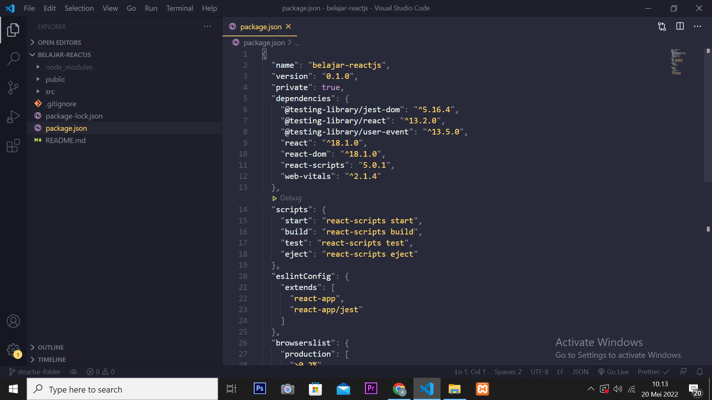

> ## Package.json

Package.json merupakan tempat untuk menjelaskan tentang nama project, deskripsinya, versi dari project yang di buat.Disini juga tempat menyimpan library sesuai dengan versinya yang di gunakan pada project yang di buat dan Disini juga tempat menulis script untuk menjalankan proses pengembangan atau untuk nge build ke production.

## package-lock.json, .gitignore, README.md

> package-lock.json tidak perlu khawatir dengan file ini kerana ketika menggunkan react jarang sekali sekali file ini di otak atik karena file ini otomatis di buat ketika package.json di ubah.

> file .gitignore adalah merupakan sebuah file yang berisi daftar nama-nama file dan direktori yang akan diabaikan oleh Git. maksudnya ketika akan mengupload file ke github contohnya maka akan di abaikan untuk di upload ke githubnya.

> README.md merupakan adalah sebuah file yang berisi penjelasan/pengantar mengenai suatu project/software

## Folder src

- index.js

index.js merupakan tempat kita memanggil atau me-render komponen utama dari aplikasi react ke dalam root yang ada di public/index.html

- App.js

App.js adalah komponen utama dari react yang dimana berfungsi sebagai container untuk semua component yang dibuat nantinya.

- App.css (optional)

App.css merupakan file untuk memberikan style css pada aplikasi react. File ini optional bisa dihapus atau tidak.

- App.test.js (advanced, optional)

App.test.js merupakan tempat untuk testing komponen apakah sudah di render sesuai dengan ekspektasi.

- index.js (optional)

index.js adalah tempat untuk memberikan style css pada aplikasi react. File ini fungsinya sama seperti App.css tapi beda tempat import aja di dalam react.

- logo.svg (optional)

logo.svg merupakan logo dari react itu sendiri.

- reportWebVitals.js (advanced, optional)

file ini merupakan tempat mengukur pengalaman user experience atau kemudahan user dalam mengakses aplikasi halaman web. Untuk pemula bisa di abaikan.

- setupTests.js (advanced, optional)

file ini tempat import test library yang dimana pada defaultnya dia meng-import '@testing-library/jest-dom'. file ini bisa dihapus untuk pemula atau yang masih bingung dengan bagaimana cara kerja testing di dalam pengembangan aplikasi react.js

## Folder public

folder public ini mengatur file static seperti index.html, javascript file, images, dan assets lainnya.

- index.html

Di file index.html ini merupakan halaman utama yang di render oleh react js.Di dalamnya terdapat attribute id dengan value root yang dimana dapat di seleksi dengan teknik DOM (Document Object Model).

- favicon.ico

File ini adalah ikon utama yang muncul pada address bar suatu laman web dan merupakan logo dari react itu sendiri;

- manifest.json

Merupakan file yang menginformasikan tentang aplikasi seperti nama, pembuat, icon, description dll.

- robots.txt

Merupakan file teks yang dibuat oleh perancang untuk mencegah mesin pencari dan bot merayapi situs.

## node_modules

adalah folder yang menyimpan kumpulan library yang di install oleh npm.Biasanya node_modules ini tidak kita upload saat ingin menyimpan applikasinya ke github.
